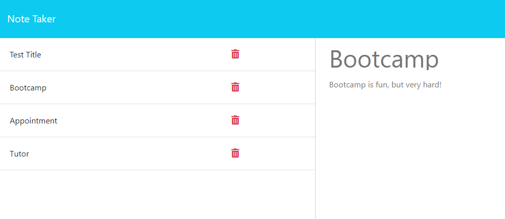

# Note Taker

## Description 
Connected the front end to an express.js backend in order to write and save notes. Notes are stored in the backend in a JSON file, each note having a unique id. Deployed app using heroku.

## Table of Contents
1. [Installation](#installation)
2. [Usage](#usage)
3. [Contributing](#contributing)
4. [Tests](#tests)
5. [License](#license)
6. [Questions](#questions)

## Installation
You can view the app [here](https://frozen-retreat-06899.herokuapp.com/).

## Usage
Open the app, then you can view saved notes and enter new notes as needed. 
  

## Contributing
N/A

## Tests
N/A

## License
Licensed under the [MIT license](https://opensource.org/license/mit/)

## Questions
You can view my GitHub repository here: [JenWariner19/note-taker](https://github.com/JenWariner19/note-taker) 
If you have any questions and would like to contact me, you can email me at: [jenniferwariner@yahoo.com](mailto:jenniferwariner@yahoo.com)
